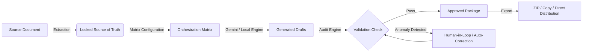

# NEXORA AI 🚀
### Intelligent Communication Orchestration Platform

[](https://saranrgb.github.io/NEXORA-AI-/)
[](https://react.dev/)
[](https://www.typescriptlang.org/)
[](https://fastapi.tiangolo.com/)
[](https://tailwindcss.com/)

---

## 🌐 Live Application
Experience the live application deployed at:  
👉 **[https://saranrgb.github.io/NEXORA-AI-/](https://saranrgb.github.io/NEXORA-AI-/)**

---

## 📌 Problem & Solution Overview

In emergency response, public healthcare campaigns, and civic administration, communicating rapid updates across diverse audiences is vulnerable to **misinformation, contradictory directives, and unauthorized discrepancies**. 

**Nexora AI** solves this with an authoritative, 6-stage communication pipeline:
1. **Source Ingestion**: Ingest raw source documents (`.pdf`, `.docx`, `.txt`) or paste directive bulletins.
2. **Source of Truth (SOT)**: Automatically parse, extract, and lock canonical facts (dates, locations, instructions, critical warnings, entities, and contacts).
3. **Multi-Channel Orchestration**: Configure matrix targets across Roles (Public, Field Officers, Media, Healthcare Workers), Formats (Alert, FAQ, Press Release, Action Checklist), Channels (WhatsApp, SMS, Email, Public Noticeboard), and Languages (English, Hindi, Tamil, Telugu).
4. **Parallel Generation**: Instantly generate role-specific communications powered by Google Gemini AI (with a zero-dependency deterministic engine for offline reliability).
5. **Deterministic Fact-Audit & Validation**: Automated validation engine scans every generated item against the locked Source of Truth to catch hallucinated dates, unauthorized venues, or missing warnings with 1-click auto-regeneration.
6. **Package Approval & Distribution**: Review, human-edit, live-copy, or download single-click `.zip` bundle packages with an audit report.

---

## 🛠️ Architecture & Workflow



---

## ✨ Key Features

- 🛡️ **Guaranteed Source of Truth Integrity**: Every deliverable is cross-checked against locked baseline facts.
- ⚡ **Autonomous Demo Mode**: Works immediately in any browser without needing backend setup or API keys.
- 🧪 **Failure Injection & Audit Simulation**: Test the engine's hallucination-detection system with 1-click anomaly injection.
- 📱 **Mobile & Desktop Responsive**: Fully optimized touch targets, mobile navigation drawer, and enterprise desktop view.
- 📦 **One-Click Package Export**: Export all approved communications as formatted plain text or organized ZIP archives with audit certificates.

---

## 💻 Local Development Setup

### Prerequisites
- Node.js (v18+)
- Python 3.10+
- Git

### 1. Clone the repository
```bash
git clone https://github.com/saranrgb/NEXORA-AI-.git
cd NEXORA-AI-
```

### 2. Quickstart with PowerShell
```powershell
./start.ps1
```

### 3. Manual Setup

#### Backend (FastAPI)
```bash
cd backend
python -m venv venv
# On Windows:
.\venv\Scripts\activate
# On Unix/macOS:
source venv/bin/activate

pip install -r requirements.txt
uvicorn main:app --reload --port 8000
```

#### Frontend (React + Vite)
```bash
cd frontend
npm install
npm run dev
```

Visit `http://localhost:5173` to test locally.

---

## 🚢 Deployment

Nexora AI is pre-configured for GitHub Pages deployment using:
- Relative Vite base paths (`./`)
- Automatic GitHub Actions workflow (`.github/workflows/deploy.yml`)
- Standalone `gh-pages` branch for zero-config static hosting
